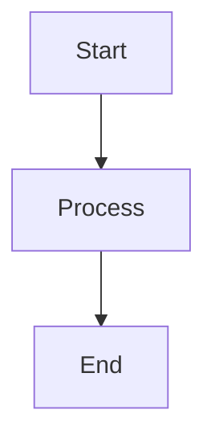
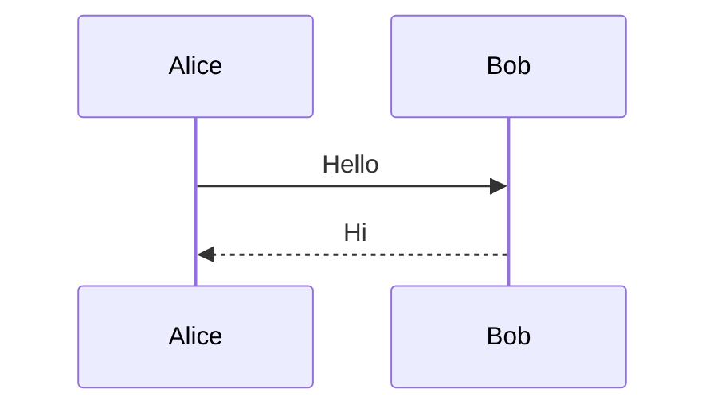
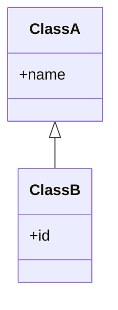
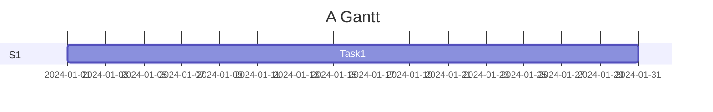
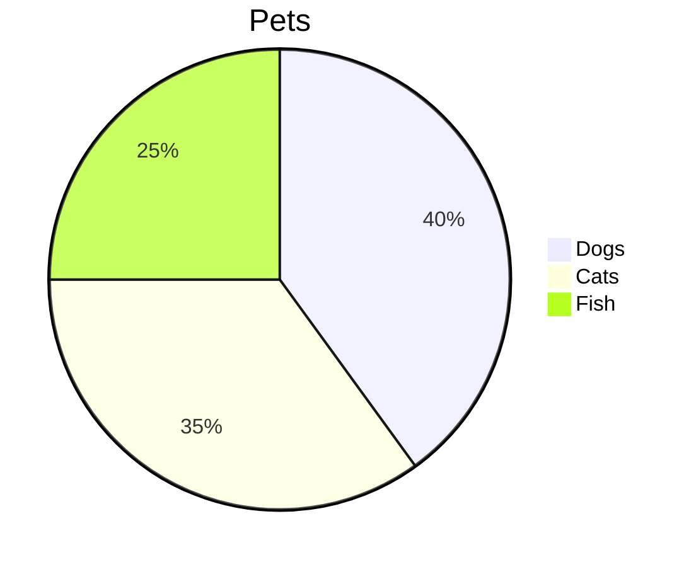

# Pele diagrams

```mermaid
graph TD
    A[Start] --> B[Process]
    B --> C[End]
```

```mermaid
sequenceDiagram
    Alice->>Bob: Hello
    Bob-->>Alice: Hi
```

```mermaid
classDiagram
    ClassA <|-- ClassB
    ClassA : +name
    ClassB : +id
```

```mermaid
gantt
    title A Gantt
    section S1
    Task1 :a1, 2024-01-01, 30d
```

```mermaid
pie title Pets
    "Dogs" : 40
    "Cats" : 35
    "Fish" : 25
```
